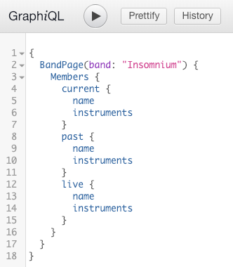

# graphql-metal-archives

GraphQL server for Metal Archives

## Build and Run
#### Requirements
- Node.js
- npm

```javascript
/* install packages */
npm install

/* start server at localhost:4000/graphql */
npm start
```

## GraphiQL
Example Query



```javascript
{
  "data": {
    "BandPage": {
      "Members": [
        {
          "current": [
            {
              "name": "Niilo Sevänen",
              "instruments": "Bass, Vocals (1997-present)"
            },
            {
              "name": "Markus Hirvonen",
              "instruments": "Drums (1997-present)"
            },
            {
              "name": "Ville Friman",
              "instruments": "Guitars (1997-present), Vocals (clean) (2011-present)"
            },
            {
              "name": "Markus Vanhala",
              "instruments": "Guitars (2011-present)"
            }
          ],
          "past": [
            {
              "name": "Tapani Pesonen",
              "instruments": "Drums (1997), Guitars (1997-1998)"
            },
            {
              "name": "Timo Partanen",
              "instruments": "Guitars (1998-2001)"
            },
            {
              "name": "Ville Vänni",
              "instruments": "Guitars (2001-2011)"
            }
          ],
          "live": [
            {
              "name": "Jani Liimatainen",
              "instruments": "Guitars, Vocals (clean) (2015, 2017-present)"
            },
            {
              "name": "Aleksi Munter",
              "instruments": "Keyboards"
            },
            {
              "name": "Tuomas Jäppinen",
              "instruments": "Guitars (2011)"
            },
            {
              "name": "Mike Bear",
              "instruments": "Bass, Vocals (2015)"
            },
            {
              "name": "Nick Cordle",
              "instruments": "Guitars (2015), Guitars, Vocals (clean) (2018)"
            },
            {
              "name": "Kari Olli",
              "instruments": "Guitars, Vocals (2015)"
            }
          ]
        }
      ]
    }
  }
}
```